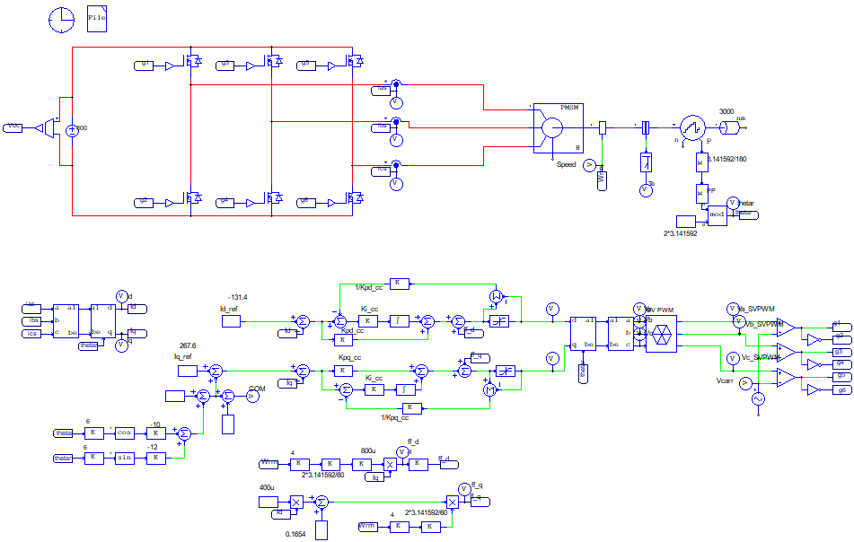
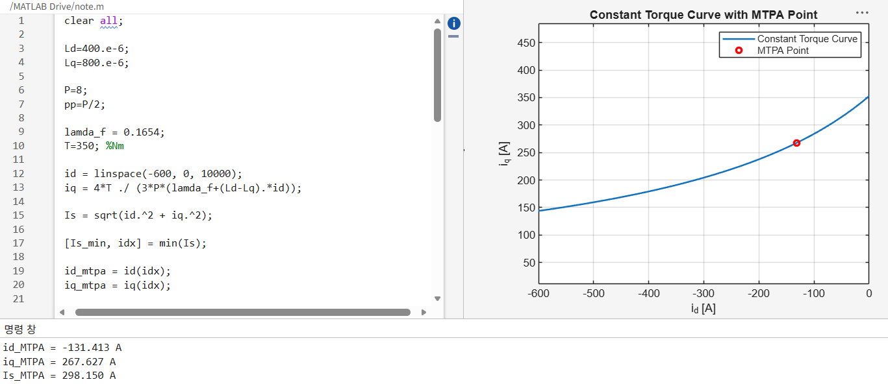
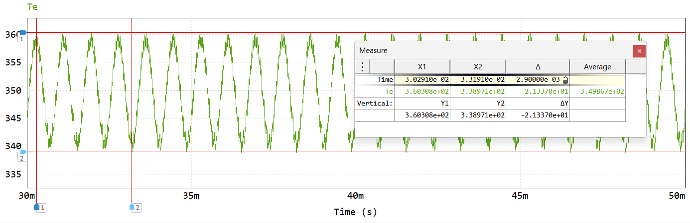
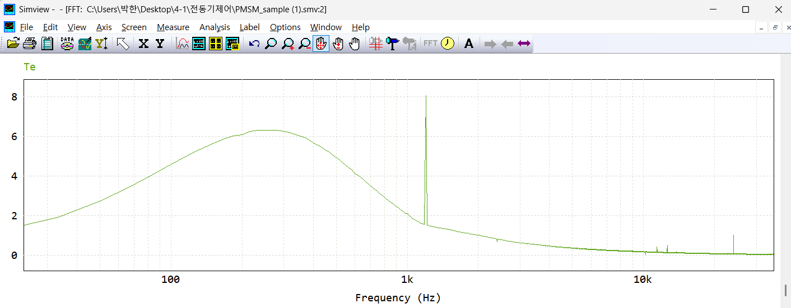
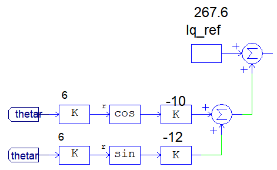
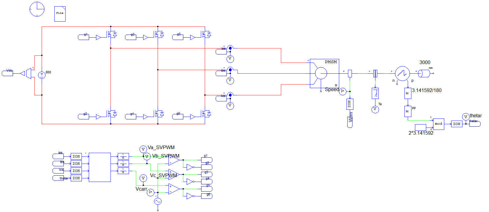
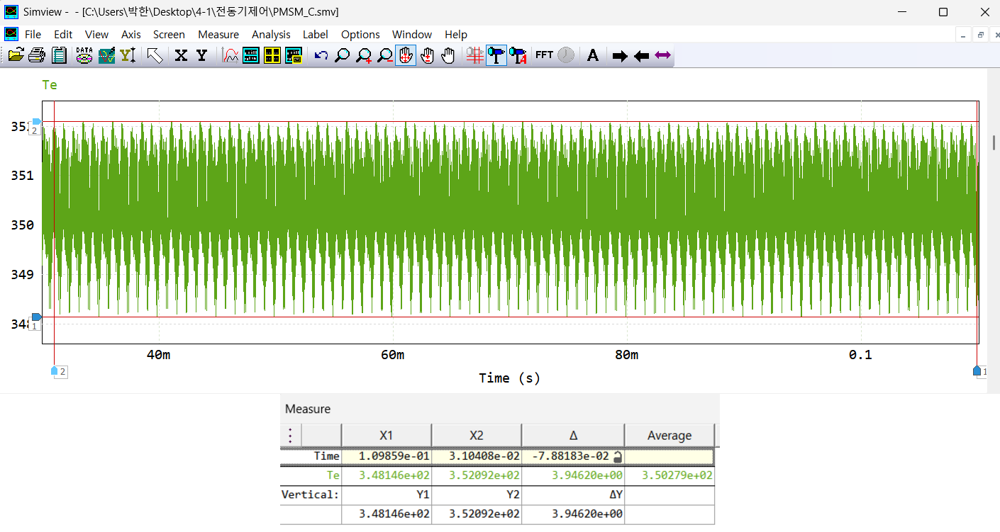

# Digital MTPA Control of an 800 V IPMSM with Sixth-Harmonic Torque-Ripple Compensation

> PSIM/MATLAB implementation of MTPA-based digital current control with one-sample delay compensation and torque-ripple reduction for an EV traction IPMSM.

## Project Overview

This project implements vector control for an **8-pole interior permanent-magnet synchronous motor (IPMSM)** supplied by an **800 V DC-link inverter**.

At the target operating point of **3,000 rpm and 350 N·m**, the MTPA current references are calculated and applied through cascaded dq-axis current controllers. A sixth-harmonic q-axis current compensation term is then introduced to suppress torque ripple caused mainly by the fifth- and seventh-order back-EMF harmonics.

The controller is converted from analog blocks to a **24 kHz digital implementation**, including zero-order holds, one-sample computation delay, phase-delay compensation, anti-windup, and SVPWM. The final controller is implemented using a simplified C block.

## Key Results

| Item | Result |
| --- | ---: |
| Target operating point | 3,000 rpm, 350 N·m |
| MTPA current reference | `id* = -131.4 A`, `iq* = 267.6 A` |
| Initial average torque | 349.87 N·m |
| Initial torque ripple (peak-to-peak) | 21.337 N·m |
| Final average torque | 350.28 N·m |
| Final torque ripple (peak-to-peak) | 3.946 N·m |
| Torque-ripple reduction | **81.5%** |

> **Scope:** All results are based on PSIM switching simulations.

## System Configuration

| Parameter | Value |
| --- | ---: |
| DC-link voltage | 800 V |
| Motor type | IPMSM |
| Pole count / pole pairs | 8 / 4 |
| Stator resistance | 0.5 Ω |
| d-axis inductance | 400 μH |
| q-axis inductance | 800 μH |
| Permanent-magnet flux linkage | 0.1654 Wb |
| Switching frequency | 12 kHz |
| Control sampling frequency | 24 kHz |
| Back-EMF THD at 4,500 rpm | 5.37% |

## Control Structure

The controller includes:

- Clarke and Park transformations
- MTPA current-reference generation
- dq-axis PI current control
- Cross-coupling and back-EMF feedforward compensation
- Voltage limiting and back-calculation anti-windup
- Inverse Park/Clarke transformations
- SVPWM gate-reference generation
- Sixth-harmonic q-axis current compensation
- One-sample digital delay and phase compensation

<p align="center">
  
</p>

<p align="center"><em>Fig. 1. IPMSM drive, dq current controller, harmonic compensation, and SVPWM structure.</em></p>

## MTPA Operating Point

For `3,000 rpm` and `350 N·m`, the constant-torque curve is searched for the minimum stator-current magnitude. The resulting references are:

- `id* = -131.4 A`
- `iq* = 267.6 A`
- `Is = 298.2 A`

<p align="center">
  
</p>

<p align="center"><em>Fig. 2. Constant-torque curve and calculated MTPA operating point.</em></p>

## Torque-Ripple Analysis and Compensation

The initial vector controller produces an average torque close to the 350 N·m target, but the measured peak-to-peak torque ripple is **21.337 N·m**.

<p align="center">
  
</p>

<p align="center"><em>Fig. 3. Initial torque response before harmonic compensation.</em></p>

FFT analysis identifies a dominant component near **1.2 kHz**. At 3,000 rpm, the electrical frequency is 200 Hz; therefore, fifth- and seventh-order back-EMF harmonics appear as sixth-order components in the synchronous dq frame.

<p align="center">
  
</p>

<p align="center"><em>Fig. 4. Dominant torque-ripple component near 1.2 kHz.</em></p>

A sixth-harmonic compensation term is added to the q-axis current command. Its amplitude and phase are retuned after introducing the digital computation delay.

<p align="center">
  
</p>

<p align="center"><em>Fig. 5. Sixth-harmonic q-axis current-reference compensation.</em></p>

## Digital Implementation

| Control stage | Average torque | Torque ripple |
| --- | ---: | ---: |
| Initial analog controller | 349.87 N·m | 21.337 N·m |
| Analog + sixth-harmonic compensation | ≈ 349.8 N·m | ≈ 4.4 N·m |
| Digital controller without computation delay | 348.78 N·m | ≈ 6.6 N·m |
| Digital controller with one-sample delay | ≈ 348.8 N·m | ≈ 14.2 N·m |
| Delay-compensated digital controller | 350.26 N·m | ≈ 4.1 N·m |
| Simplified C-block implementation | **350.28 N·m** | **3.946 N·m** |

The one-sample delay increases the phase error and torque ripple. Compensation is applied to the electrical angle used for modulation, while the sixth-harmonic amplitude and phase are retuned. The complete digital controller is then consolidated into a simplified C block.

<p align="center">
  
</p>

<p align="center"><em>Fig. 6. Final digital control structure using a simplified C block.</em></p>

<p align="center">
  
</p>

<p align="center"><em>Fig. 7. Final torque response: 350.28 N·m average torque and 3.946 N·m peak-to-peak ripple.</em></p>

## Tools

- **PSIM 2024** — switching model and digital controller simulation
- **MATLAB** — MTPA operating-point calculation
- **C block** — integrated digital current-control implementation

## Future Work

- Verify performance across variable speed and load conditions
- Quantify RMS-current and copper-loss changes caused by harmonic injection
- Evaluate parameter sensitivity, current limits, dead time, and inverter nonlinearities
- Perform HILS and experimental validation

## Repository Structure

```text
IPMSM-MTPA-Torque-Ripple-Reduction/
├── README.md
└── figures/
    ├── 01-drive-and-control-overview.png
    ├── 02-mtpa-operating-point.png
    ├── 03-initial-torque-ripple.png
    ├── 04-torque-ripple-fft.png
    ├── 05-sixth-harmonic-compensation.png
    ├── 06-final-c-block-implementation.png
    └── 07-final-torque-response.png
```
